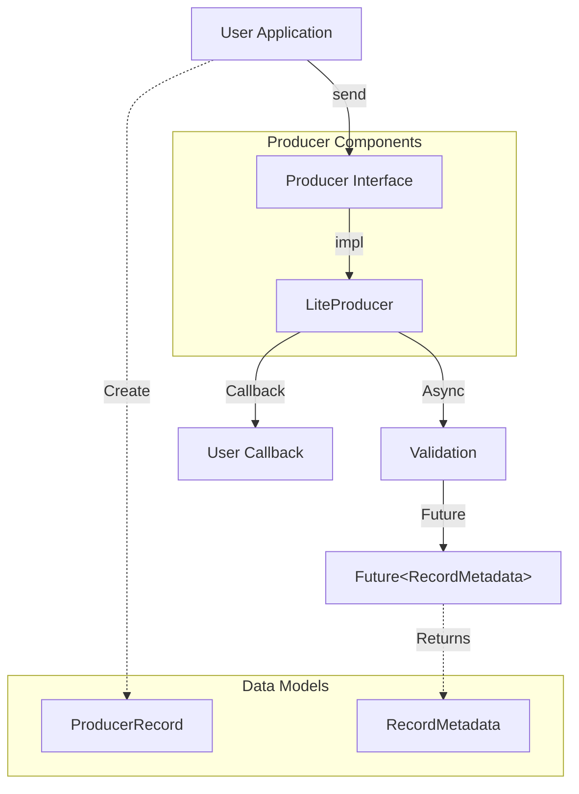

# Distributed Queue Producer Module

This module provides a lightweight, thread-safe client for publishing records to the distributed queue. It is designed with an API similar to Apache Kafka's Producer API, making it familiar and easy to use.

## High-Level Architecture

The producer utilizes an asynchronous, non-blocking architecture.



## Key Components

| Component | Description |
|-----------|-------------|
| **`Producer<K, V>`** | The core interface for sending records. It extends `Closeable` to ensure proper resource management. |
| **`LiteProducer`** | The default implementation of the `Producer` interface. It handles message dispatching asynchronously. |
| **`ProducerRecord<K, V>`** | Represents a key/value pair to be sent to a specific topic. |
| **`RecordMetadata`** | Metadata returned after a successful send, containing the topic, partition, and offset. |
| **`Callback`** | A functional interface for handling asynchronous completion of a send request. |

## Functionality Specification

-   **Asynchronous Sending**: The `send()` method returns a `Future`, allowing the application to wait for the result or continue processing.
-   **Callbacks**: Supports optional callbacks that are triggered when the record has been acknowledged (or when sending fails).
-   **Thread Safety**: The producer is thread-safe and sharing a single producer instance across threads will generally be faster than having multiple instances.
-   **Java Records**: Utilizes modern Java 21+ layout for immutable data carriers (e.g., `RecordMetadata`).

## Usage Examples

### 1. Basic Fire-and-Forget (Blocking Future)

```java
import com.distributedqueue.producer.*;
import java.util.concurrent.Future;

// 1. Create the producer
try (Producer<String, String> producer = new LiteProducer<>()) {
    
    // 2. Create a record
    ProducerRecord<String, String> record = 
        new ProducerRecord<>("my-topic", "key-1", "Hello World");
    
    // 3. Send and wait for result (Blocking)
    Future<RecordMetadata> future = producer.send(record);
    RecordMetadata metadata = future.get();
    
    System.out.printf("Sent to topic %s at offset %d%n", 
        metadata.topic(), metadata.offset());
}
```

### 2. Asynchronous with Callback

```java
import com.distributedqueue.producer.*;

try (Producer<String, String> producer = new LiteProducer<>()) {
    ProducerRecord<String, String> record = 
        new ProducerRecord<>("orders", "order-id-123", "PAYMENT_RECEIVED");
    
    // 3. Send with callback (Non-blocking)
    producer.send(record, (metadata, exception) -> {
        if (exception != null) {
            exception.printStackTrace();
        } else {
            System.out.println("Async send completed for topic: " + metadata.topic());
        }
    });
}
```
